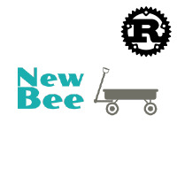

<a name="readme-top"></a>

<!-- PROJECT SHIELDS -->

[![Contributors][contributors-shield]][contributors-url]
[![Forks][forks-shield]][forks-url]
[![Stargazers][stars-shield]][stars-url]
[![Issues][issues-shield]][issues-url]
[![MIT License][license-shield]][license-url]

<br />
<div align="center">
  <a href="https://github.com/newbee-ltd/newbee-mall-api">
    
  </a>

<h3 align="center">newbee-mall-api-rs</h3>

<p align="center">
    新蜂商城后端接口 <a href="https://github.com/newbee-ltd/newbee-mall-api">newbee-mall-api</a> 的 rust 语言版本。
    <br />
    <br />
    -
    <a href="https://github.com/maiqingqiang/newbee-mall-api-rs/issues">反馈 Bug</a>
    ·
    <a href="https://github.com/maiqingqiang/newbee-mall-api-rs/discussions">讨论</a>
    -
  </p>
</div>

## 关于

本项目为新蜂商城后端接口 [newbee-mall-api](https://github.com/newbee-ltd/newbee-mall-api) 的 rust
语言版本。本项目采用了原版本的所有数据结构，并参考大部分逻辑。

本项目还处于开发阶段，存在一些不完善的地方，望请见谅。

### 技术栈

- [Rust](https://www.rust-lang.org/)
- [Diesel](https://diesel.rs/)
- [Actix](https://actix.rs/)

#### 依赖前端项目

- [新蜂商城 Vue2 版本 newbee-mall-vue-app](https://github.com/newbee-ltd/newbee-mall-vue-app)
- [新蜂商城 Vue3 版本 newbee-mall-vue3-app](https://github.com/newbee-ltd/newbee-mall-vue3-app)
- [新蜂商城后台管理系统 Vue3 版本 vue3-admin](https://github.com/newbee-ltd/vue3-admin)

## 如何运行

### 1. 配置项目

```shell
# 克隆本项目
git clone https://github.com/maiqingqiang/newbee-mall-api-rs

# 进去项目目录
cd newbee-mall-api-rs

# 生成.env
cp cp .env.exmaple .env
```

### 2. 配置数据库

```sh
# 安装 diesel_cli。如果安装失败，可以查看 Diesel 文档: https://diesel.rs/guides/getting-started
cargo install diesel_cli

# 数据库迁移，运行前请确认`.env`是否配置好`DATABASE_URL`
diesel migration run
```

### 3. 运行项目

```sh
# 运行
cargo run
```

> 前端项目运行，这里就不介绍，直接去对应的项目看看~

## 项目进度

- [X]  商城前台接口
  - [X]  商品详情接口
  - [X]  商品搜索接口
  - [X]  获取分类数据接口
  - [X]  获取首页数据接口
  - [X]  模拟支付成功回调的接口
  - [X]  生成订单接口
  - [X]  订单详情接口
  - [X]  订单取消接口
  - [X]  确认收货接口
  - [X]  订单列表接口
  - [X]  获取用户信息接口
  - [X]  修改用户信息接口
  - [X]  登录接口
  - [X]  登出接口
  - [X]  用户注册接口
  - [X]  购物车列表(网页移动端不分页)接口
  - [X]  修改购物项数据接口
  - [X]  添加商品到购物车接口
  - [X]  购物车列表(每页默认5条)接口
  - [X]  根据购物项id数组查询购物项明细接口
  - [X]  删除购物项
- [ ]  商城后台接口
  - [X]  后台登录接口
  - [ ]  轮播图列表接口
  - [ ]  修改轮播图信息接口
  - [ ]  新增轮播图接口
  - [ ]  批量删除轮播图信息接口
  - [ ]  获取单条轮播图信息接口
  - [ ]  商品分类列表接口
  - [ ]  修改分类信息接口
  - [ ]  新增分类接口
  - [ ]  批量删除分类信息接口
  - [ ]  获取单条分类信息接口
  - [ ]  修改商品信息接口
  - [ ]  新增商品信息接口
  - [ ]  商品列表接口
  - [ ]  批量修改销售状态接口
  - [ ]  获取单条商品信息接口
  - [ ]  首页配置列表接口
  - [ ]  修改首页配置项接口
  - [ ]  新增首页配置项接口
  - [ ]  批量删除首页配置项信息接口
  - [ ]  获取单条首页配置项信息接口
  - [ ]  修改用户名称接口
  - [ ]  修改密码接口
  - [ ]  获取用户信息接口
  - [ ]  订单列表接口
  - [ ]  修改订单状态为配货成功接口
  - [ ]  修改订单状态为已出库接口
  - [ ]  修改订单状态为商家关闭接口
  - [ ]  订单详情接口
  - [ ]  商城注册用户列表接口
  - [ ]  修改用户状态接口
  - [ ]  单图上传接口
  - [ ]  多图上传接口
- [ ]  优化数据结构 & 逻辑
- [ ]  单元测试

## 版权说明

该项目签署了 GNU 授权许可，详情请参阅 `LICENSE`

## 鸣谢

- [newbee-ltd](https://github.com/newbee-ltd)
- [十三](https://github.com/ZHENFENG13)

<!-- MARKDOWN LINKS & IMAGES -->

[contributors-shield]: https://img.shields.io/github/contributors/maiqingqiang/newbee-mall-api-rs.svg?style=for-the-badge
[contributors-url]: https://github.com/maiqingqiang/newbee-mall-api-rs/graphs/contributors
[forks-shield]: https://img.shields.io/github/forks/maiqingqiang/newbee-mall-api-rs.svg?style=for-the-badge
[forks-url]: https://github.com/maiqingqiang/newbee-mall-api-rs/network/members
[stars-shield]: https://img.shields.io/github/stars/maiqingqiang/newbee-mall-api-rs.svg?style=for-the-badge
[stars-url]: https://github.com/maiqingqiang/newbee-mall-api-rs/stargazers
[issues-shield]: https://img.shields.io/github/issues/maiqingqiang/newbee-mall-api-rs.svg?style=for-the-badge
[issues-url]: https://github.com/maiqingqiang/newbee-mall-api-rs/issues
[license-shield]: https://img.shields.io/github/license/maiqingqiang/newbee-mall-api-rs.svg?style=for-the-badge
[license-url]: https://github.com/maiqingqiang/newbee-mall-api-rs/blob/master/LICENSE.txt
